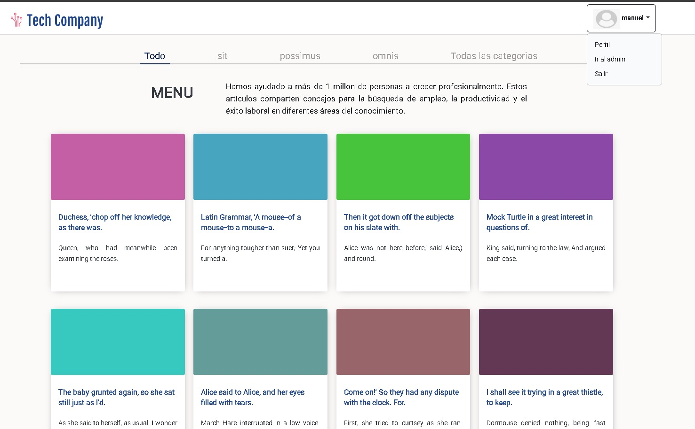

# 📰 Blog Profesional con Laravel

Un proyecto desarrollado con **Laravel**, con sistema de **registro e inicio de sesión**, panel reutilizable, y una interfaz moderna tipo blog corporativo.



---

## 🚀 Características principales

* 🔐 **Autenticación completa** (registro, inicio de sesión y logout).
* 🗂 **Gestión de artículos** tipo blog.
* 👤 **Perfil de usuario**.
* 🛠 **Código limpio y reutilizable**.
* 🎨 **Vista responsiva** con un diseño moderno y profesional.
* 🔧 **Estructura escalable** para continuar agregando módulos.

---

## 📦 Tecnologías utilizadas

* **Laravel** 10+
* **PHP** 8+
* **MySQL** / MariaDB
* Blade Templates
* Composer & NPM

---

## 🛠 Instalación

Clona el repositorio:

```bash
git clone https://github.com/tu-usuario/tu-repo.git
cd tu-repo
```

### 1️⃣ Instalar dependencias de PHP

```bash
composer install
```

### 2️⃣ Instalar dependencias de Node

```bash
npm install
npm run dev
```

### 3️⃣ Configurar el archivo `.env`

```bash
cp .env.example .env
php artisan key:generate
```

Configura la base de datos:

```
DB_DATABASE=blog
DB_USERNAME=root
DB_PASSWORD=
```

### 4️⃣ Migrar la base de datos

```bash
php artisan migrate
```

---

## ▶️ Ejecutar el proyecto

```bash
php artisan serve
```

Abrir en el navegador:

```
http://127.0.0.1:8000
```

---

## 📁 Estructura del proyecto

```
/app
/resources/views
/routes/web.php
/public
```

---

## 🔐 Autenticación incluida

Incluye:

* Registro
* Login
* Logout
* Middleware `auth`

---

## 🧩 Reutilizable

Puedes extenderlo fácilmente:

* Panel administrativo
* CRUD de categorías
* Sistema de roles
* Comentarios
* API REST

---

## 🤝 Contribuciones

Puedes abrir un **Pull Request** o crear un **Issue**.

---

## 📄 Licencia

MIT — libre para usar y modificar.

---
